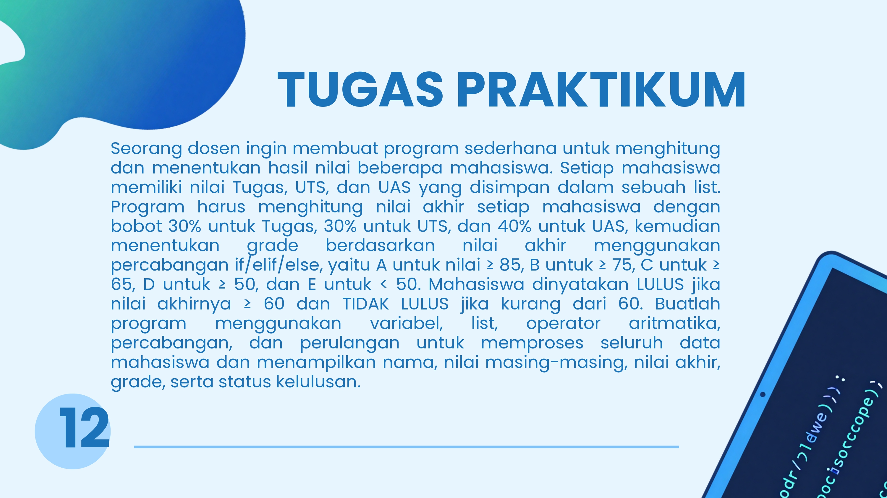

# Tugas 1

Program Penghitung Nilai Akhir, Grade, dan Status Kelulusan Mahasiswa.
Dibuat untuk memenuhi Tugas 1 Praktikum Algoritma dan Pemrograman.

## Anggota Kelompok
- 2605176004 - Maisaroh Elvin Aldiyani
- 2605176027 - Rahmat Adha
- 2605176028 - Rahmat Noor Sani

## Instruksi Tugas


## Ketentuan Penilaian
Bobot nilai akhir: Tugas 30%, UTS 30%, UAS 40%.

| Nilai Akhir | Grade |
|-------------|-------|
| ≥ 85        | A     |
| ≥ 75        | B     |
| ≥ 65        | C     |
| ≥ 50        | D     |
| < 50        | E     |

Status kelulusan: **LULUS** jika nilai akhir ≥ 60, selain itu **TIDAK LULUS**.

## Contoh Output
```
[✓] Nama  : Maisaroh Elvin Aldiyani
[✓] TUGAS : 99
[✓] UTS   : 99
[✓] UAS   : 99
[✓] Nilai : 99.0
[✓] Grade : A
[✓] Status: LULUS
------------------------------
```
